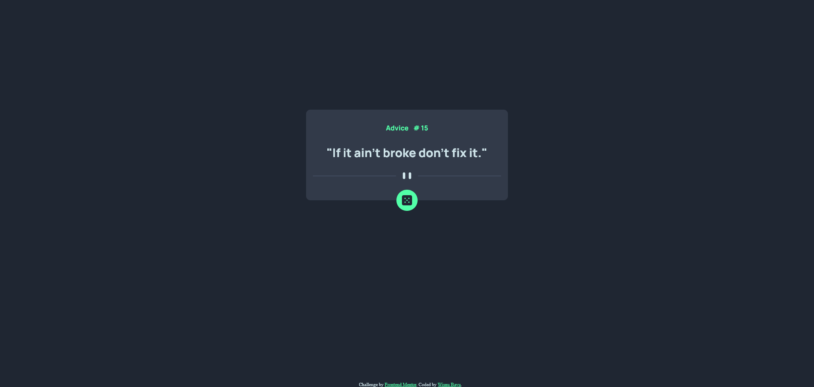

# Frontend Mentor - Advice generator app solution

This is a solution to the [Advice generator app challenge on Frontend Mentor](https://www.frontendmentor.io/challenges/advice-generator-app-QdUG-13db). Frontend Mentor challenges help you improve your coding skills by building realistic projects.

## Table of contents

-   [Overview](#overview)
    -   [The challenge](#the-challenge)
    -   [Screenshot](#screenshot)
    -   [Links](#links)
-   [My process](#my-process)
    -   [Built with](#built-with)
    -   [Useful resources](#useful-resources)
-   [Author](#author)

## Overview

### The challenge

Users should be able to:

-   View the optimal layout for the app depending on their device's screen size
-   See hover states for all interactive elements on the page
-   Generate a new piece of advice by clicking the dice icon

### Screenshot

### Links

-   Solution URL: [Frontendmentor URL](https://www.frontendmentor.io/solutions/advice-generator-app-with-fetch-api--ny2ZfCCxb)
-   Live Site URL: [Live site URL](https://wishba.github.io/advice-generator-app-main/)

## My process

### Built with

-   Semantic HTML5 markup
-   CSS custom properties
-   CSS Grid
-   Mobile-first workflow

### Useful resources

-   [Fetch API MDN reference](https://developer.mozilla.org/en-US/docs/Web/API/Fetch_API/Using_Fetch)
-   [Freecodecamp - learn data visualization](https://www.freecodecamp.org/learn/data-visualization/#json-apis-and-ajax)
-   [CSS Neon Button Effects on Hover](https://youtu.be/R3KpvmS19GQ?t=200) - css box shadow use cased.

## Author

-   Github - [@wishba](https://github.com/wishba/)
-   Frontend Mentor - [@wishba](https://www.frontendmentor.io/profile/wishba)
-   Twitter - [@wishba\_](https://twitter.com/wishba_)
